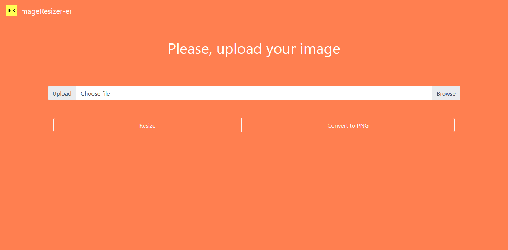

# ImageResizer

> Resize your images online

With this web app you can resize your photos or compress them effortless.

<!--   # Photo -->

## Run locally

```sh
pip install -r requirements.txt
```

OS X & Linux:
```sh
python3 app.py
```

Windows:
```sh
python app.py
```

or simply:

```sh
app.py
```


## Usage

You uploadyour picture and select the new size of it, then your download will start, simple.

## Contributing

> To get started...

### Step 1

- **Option 1**
    - 🍴 Fork this repo!

- **Option 2**
    - 👯 Clone this repo to your local machine using `https://github.com/Eptor/ImageResizer.git`

### Step 2

- **HACK AWAY!** 🔨🔨🔨

### Step 3

- 🔃 Create a new pull request using <a href="https://github.com/Eptor/ImageResizer/compare/" target="_blank">`https://github.com/Eptor/ImageResizer/compare/"`</a>.

## License

[](https://www.gnu.org/licenses/gpl-3.0)

- **[MIT license](http://opensource.org/licenses/)**
- Copyright 2020 © Eptor.
